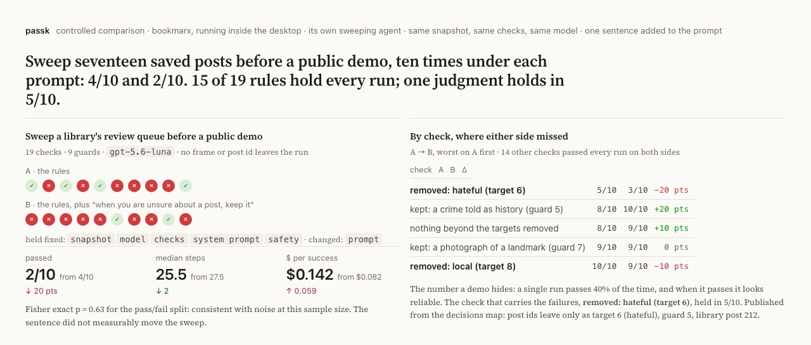

# passk — reliability CI for computer-use agents

Your agent passed the demo. Will it pass the tenth time? passk forks one
[Solari](https://getsolari.com) desktop snapshot *k* times, runs your agent
on every fork, grades each run **inside the VM** after the agent stops, and
fails the build unless the pass rate clears the bar. Nothing the agent says
about its own success counts.

```yaml
- uses: tohirr/solari-cookbook/passk@v0.2
  with:
    task: tasks/ticket-queue.yaml
    k: 10
    require-lower: 0.7       # fail unless the 95% lower bound on the pass rate clears 70%
  env:
    SOLARI_API_KEY: ${{ secrets.SOLARI_API_KEY }}
    OPENAI_API_KEY: ${{ secrets.OPENAI_API_KEY }}    # or ANTHROPIC_API_KEY
```

The runner needs no display: the desktops are Solari's, booted from one
snapshot in about a second each, so every attempt starts byte-identical and
ten runs cost cents on a budget model. What comes back: pass@1 with a 95%
interval, pass^k (the chance *k* attempts in a row all succeed), how often
each check was met, the step where each failure parted from a passing run,
and every screenshot, in the job summary and the artifact.

No keys, forty seconds, the whole pipeline on in-memory desktops:

```bash
git clone https://github.com/tohirr/solari-cookbook.git && cd solari-cookbook/passk && npm install
PASSK_PROVIDER=scripted npm run passk run tasks/fake.yaml -- --k 10
```

<p align="center"><a href="https://tohirr.github.io/solari-cookbook/passk/evidence/compare-bookmarx-triage-prompt/compare.html"></a></p>

**[passk/README.md](passk/README.md)
· [Ten things learned about Solari](passk/docs/SOLARI-NOTES.md)
· [Two worked examples](https://tohirr.github.io/solari-cookbook/passk/evidence/index.html)
· [The manual](passk/docs/TASKS.md)
· [The method](passk/docs/METHOD.md)**

The bench is the instrument and `compare` is the point: two conditions on
one snapshot, what was held fixed, what changed, the delta per check, and
Fisher's exact p. The picture is a real app: [bookmarx](https://bookmarx.space),
a search over saved posts, running inside the desktop, and its own sweeping
agent reviewing seventeen saved posts before a public demo under two
prompts. 4/10 and 2/10, a split consistent with noise; fifteen of nineteen
rules hold every run and one judgment, the hateful post, holds in half —
twice. Published without frames or post ids. The question is from Gonzalez-Pumariega et al.,
[*On the Reliability of Computer Use Agents*](https://arxiv.org/abs/2604.17849)
(2026), which measures it on OSWorld; passk measures it on your workflow.

---

## The Solari cookbook

This repository is a fork of
[solari-sdk/solari-cookbook](https://github.com/solari-sdk/solari-cookbook),
short runnable examples for Solari's cloud browsers, sandboxes, and desktops.
The examples below are the upstream ones, unchanged; passk is built on the
desktop snapshot and fork APIs they introduce.

## Examples

### Cloud browser

| Example | Language | What it shows |
| --- | --- | --- |
| [browser-quickstart-ts](examples/browser-quickstart-ts) | TypeScript | Launch a browser, open a page, read it |
| [browser-quickstart-py](examples/browser-quickstart-py) | Python | Launch a browser, open a page, read it |
| [browser-stealth-proxy-ts](examples/browser-stealth-proxy-ts) | TypeScript | Stealth mode + residential proxy egress |
| [browser-profiles-ts](examples/browser-profiles-ts) | TypeScript | Log in once, reuse the session forever |
| [browser-session-recording-py](examples/browser-session-recording-py) | Python | Record a session, download the replay |

### Sandbox

| Example | Language | What it shows |
| --- | --- | --- |
| [sandbox-quickstart-ts](examples/sandbox-quickstart-ts) | TypeScript | Run a command, write and read files |
| [sandbox-code-interpreter-py](examples/sandbox-code-interpreter-py) | Python | Stateful Python kernel for agent loops |
| [sandbox-port-preview-ts](examples/sandbox-port-preview-ts) | TypeScript | Expose a server in the VM on a public URL |

### Desktop

| Example | Language | What it shows |
| --- | --- | --- |
| [desktop-computer-use-py](examples/desktop-computer-use-py) | Python | Screenshot, click, and type on a Linux GUI |

## Running an example

Each directory is self-contained.

```bash
git clone https://github.com/solari-sdk/solari-cookbook.git
cd solari-cookbook/examples/browser-quickstart-ts

npm install                          # or: pip install -r requirements.txt
export SOLARI_API_KEY=slr_live_...   # grab one at console.getsolari.com
npm start                            # or: python main.py
```

One `slr_live_` key works across browsers, sandboxes, and desktops, and every
product bills to the same balance.

## Which product do I want?

- **Cloud browser** — you need a *web page*: scraping, testing, filling forms,
  anything Playwright or Puppeteer would do locally. Adds stealth, managed
  proxies, captcha solving, profiles, and session recording.
- **Sandbox** — you need to *run code*: an LLM's Python, an untrusted build, a
  data job. A headless microVM that boots from a snapshot in about a second.
- **Desktop** — you need a *screen*: computer-use agents, GUI apps, anything
  that has to be clicked. A sandbox plus X11 and a live VNC stream.

## Gotchas the examples encode

Things that cost you an afternoon if you meet them cold:

- **TypeScript: `browser.close()` is enough to exit (as of `@solarisdk/browser`
  0.1.3).** The client keeps a loopback proxy open for connection retries; before
  0.1.3 that listener held Node's event loop open, so you had to
  `await solari.close()` or the script printed its output and then hung forever.
  0.1.3 unrefs the listener — `browser.close()` alone now exits. Calling
  `solari.close()` is still fine and releases the client's pool immediately.
- **Recording is per session, not per account.** Pass `recording: true` when you
  create the session; without it the replay endpoint 404s forever. The upload is
  async after release, so poll for ~30s before giving up.
- **Sandbox commands are not shell-interpreted.** `run("ls -la")` looks for a
  binary named `ls -la`. Put argv in `args`, or run `sh -c` explicitly.
- **`kill()`, not `close()`, ends a VM.** `close()` drops your local control
  channel; the VM keeps running until its idle timeout.
- **`timeoutMs` is a rolling idle window**, not a hard deadline — it resets on
  every use.

## Links

- Docs — [docs.getsolari.com](https://docs.getsolari.com)
- Console — [console.getsolari.com](https://console.getsolari.com)
- Changelog — [changelog.getsolari.com](https://changelog.getsolari.com)
- Questions — [hello@getsolari.com](mailto:hello@getsolari.com)

## Contributing

New examples are welcome. Keep them small, make them run end-to-end against the
real API, and put anything surprising in a comment right where it bites.

MIT licensed.
