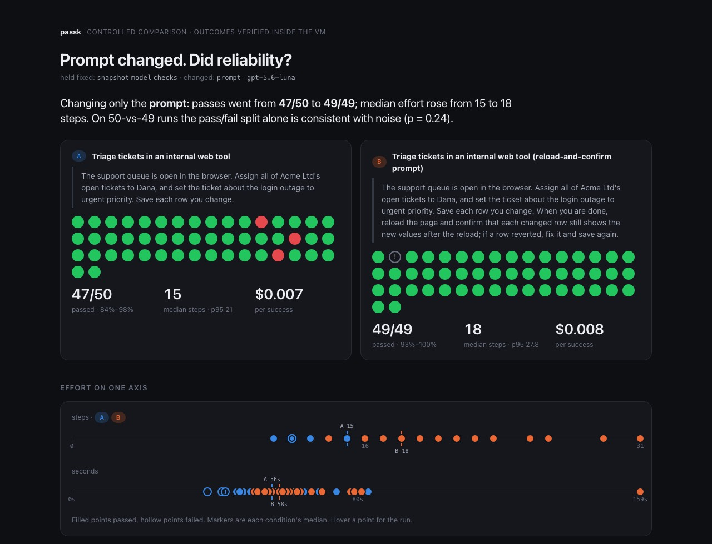

# passk

**Reliability regression testing for computer-use agents.** Does yours pass twice?

> **Status: built in public, evidence published.** Nine tasks across three
> Solari templates, 250+ verified runs, one controlled three-way experiment,
> and a mock accounts-payable workflow, all on a budget model for under $4 of
> model spend. Every number is in [`evidence/`](evidence/) with screenshots
> and traces. The Claude agent loop is written but unexercised for want of a
> working key; the OpenAI loop produced everything here.

<p align="center"><a href="https://tohirr.github.io/solari-cookbook/passk/evidence/compare-ticket-queue-baseline-vs-reload/compare.html"></a></p>

**Start here:** [the front page](https://tohirr.github.io/solari-cookbook/passk/), the leaderboard by task shape. `npm run studio` serves the same board from your machine with a key form and a Run button that starts real benches (see [Studio](#studio)). Then [the planner](https://tohirr.github.io/solari-cookbook/passk/studio/), a browser front for every task, experiment and comparison with a planner that says what k runs can prove and cost, or [the showcase](https://tohirr.github.io/solari-cookbook/passk/evidence/index.html), with every
number read from the bench files (rendered by GitHub Pages; the source is in [`evidence/`](evidence/)). `sh demo.sh` runs the whole pipeline in forty
seconds with no API spend.

**Who it's for.** passk is for teams shipping computer-use agents. An engineer
defines a task and its success criteria once; passk executes it repeatedly
from the same state and produces a report that engineering, product and
operations can all read. The operator is an agent or QA engineer. The report
consumer does not need to know what YAML is. The interface is a CLI plus YAML
task files, on purpose: like a test runner, it is configuration as code, and
the hard part of any task is the verifier, which is not something a wizard
can write for you.

`passk` forks one Solari desktop snapshot *k* times, runs the same task on every
fork with the same agent, and tells you two things a single demo never will:

1. **pass^k** — the probability that *all k* attempts succeed. This is the number
   a user feels. An agent at 80% pass@1 is at 33% pass^5.
2. **Why the failures happened** — each failing run is diffed against a passing
   sibling to find the first step where they diverge, then sorted into one of the
   three sources of unreliability from Pinetree's *On the Reliability of Computer
   Use Agents* (2026): stochastic execution, task ambiguity, or behavior
   variability.

It also ships a **probe**: before spending k runs, fork one throwaway desktop, let
the agent look around, and have it list every question it would ask a human.
Tighten the prompt, re-probe, then bench.

Built on Solari because it is the only place this is cheap: `snapshot()` once,
`createDesktop({ fromSnapshot })` k times, every fork boots byte-identical in
about a second.

## Setup

You need Node 20 or newer, a Solari account, and one model key.

```bash
git clone https://github.com/tohirr/solari-cookbook.git
cd solari-cookbook/passk
npm install
cp .env.example .env
```

Open `.env` and fill in:

| Variable | Where it comes from |
|---|---|
| `SOLARI_API_KEY` | [console.getsolari.com](https://console.getsolari.com) → API keys. The free tier allows 1 concurrent desktop; Starter allows 2 and includes $20 of credit. |
| `OPENAI_API_KEY` **or** `ANTHROPIC_API_KEY` | Your model provider. With both set, Claude is used unless `PASSK_PROVIDER=openai`. |
| `PASSK_MODEL` | Optional. `gpt-5.6-luna` is the budget tier every result here was produced on; leave unset for the provider's default. |
| `PASSK_SAFETY=allow` | Set this for benches: it lets the OpenAI loop acknowledge its own safety checks inside the disposable VM. Never set it anywhere real. |
| `PASSK_CONCURRENCY` | Optional. Defaults to 2. Match your Solari plan. |

Then confirm everything talks to everything:

```bash
npm run passk doctor
```

It checks the keys, reaches Solari, boots and kills one desktop, sends the
model a one-token request, and prints what a run would use. Fix anything it
marks ✗ before going further. The commands in these docs are written as
`passk …`; run them as `npm run passk -- …` or set `alias passk="npx tsx src/cli.ts"`
inside the `passk/` folder.

Results land in `runs/<task>-<timestamp>/` (ignored by git); the curated,
committed copies live in [`evidence/`](evidence/).

## Studio

The leaderboard, on localhost, with your keys and a working Run button:

```bash
npm run studio          # http://127.0.0.1:8787, opens the browser
```

Paste your Solari key and a model key into the form; they are written to
`passk/.env` on this machine and go only to Solari and the model provider,
by the runs you start. Pick a shape, a model, k, a budget, and Start. Each
run is `passk run` in a child process with exactly the command the board
shows, so the button and the docs never disagree. The row appears as
"local" when it finishes, with its report. The board is served only on
127.0.0.1; nothing about a run leaves your machine unless you export the
bench into `evidence/` and send it as a pull request, which is how the
published board gains a row.

Try it with no keys: choose the model `scripted` and the row runs the
harness on in-memory desktops in a few seconds.

## Quick start

After [Setup](#setup):

```bash
npm run passk prepare  tasks/notes.yaml        # boot → setup → snapshot → kill
npm run passk validate tasks/notes.yaml        # prove the checks fail before and pass after the golden steps
npm run passk probe    tasks/notes.yaml        # what would the agent ask before acting?
npm run passk run      tasks/notes.yaml -- --k 5
open runs/notes-*/report.html
```

Then the gates and budget:

```bash
npm run passk run tasks/notes.yaml -- --k 10 --budget 0.50     # stop launching runs at $0.50 of model spend
npm run passk run tasks/notes.yaml -- --k 10 --require 0.9     # exit 2 unless observed pass@1 ≥ 90%
npm run passk gate runs/notes-*/ -- --require-lower 0.7        # same gate on a saved bench, for CI
```

## How it works

```
prepare   boot template ──▶ run setup ──▶ snapshot ──▶ kill
run       fork ×k from snapshot ──▶ agent loop on each ──▶ checks ──▶ kill
          ──▶ pass@k / pass^k ──▶ diff failing traces vs passing ──▶ classify ──▶ report.html
```

- `src/agent/anthropic.ts` — Claude computer-use loop (`computer_toolset_20260801`).
- `src/agent/openai.ts` — GPT-5.x loop via the Responses API `computer` tool.
  `PASSK_PROVIDER` picks one; add a file to `src/agent/` to bench your own agent.
- `src/llm.ts` — provider-neutral structured-output call used by the judge,
  the classifier and the probe, so a bench never mixes models.
- `src/agent/computer.ts` — maps computer-use actions onto Solari's desktop RPCs.
- `src/metrics.ts` — unbiased pass@k and pass^k estimators.
- `src/classify.ts` — divergence point + cause classification.
- `src/probe.ts` — the ambiguity dry-run.

## Tasks that ship

Every task is **validated**: its verifier proved sound by `passk validate`
and its live runs published in `evidence/`. The format and the status
convention are in [the operator's manual](docs/TASKS.md).

| Task | Template | Status | What it exercises |
|---|---|---|---|
| `notes` / `notes-nodir` | default | validated, 5 + 5 runs | Save-dialog handling; an environment pair (folder present vs missing) |
| `rename-invoices` / `-clarified` | default | validated, 5 + 5 runs | File manager; a prompt pair (ambiguous vs spelled out) |
| `q3-total` | office | validated, 10 runs | LibreOffice Calc, formulas, the CSV "keep format" dialog |
| `ticket-queue` / `-verify` / `-reload` | default | validated, 50 + 50 + 50 runs | An internal web tool served from inside the VM: no login, no proxy, state in a JSON file the checker reads. One of the customer's tickets is closed and must not be touched. Three prompt conditions on one snapshot. |
| `invoice-entry` | office | validated, 30 runs | Accounts payable: read a PDF from Incoming, enter it into LedgerDesk (a mock AP tool served from inside the VM), attach the file, save as Pending review. A duplicate trap, a wrong-vendor decoy, and Approve/Pay buttons that must stay untouched. Verified against the ledger, including the attachment's sha256. |
| `fake` | none | harness test | Runs on the scripted provider; exercises the pipeline with no VM or model |

LedgerDesk and the ticket queue are mocks on purpose. A mock lets the bench
own the state, plant a trap, and verify exactly. What they keep from the real
thing is the shape: existing records to search, a duplicate to avoid, required
fields, dropdowns, a file upload, a business rule ("pending review"), and a
consequential action that must not happen.

The ticket queue is the shape of task Pinetree describes: a proprietary
dashboard with no API. Because the app lives in the snapshot, fifty runs cost
about a dollar on a budget model.

## Evidence

[`evidence/`](evidence/) holds every bench cited in this README: `bench.json`
with every action, check, provenance record and task hash; the report page;
the final screenshot of every run; and every screenshot of every failed run
and of the shortest passing run. Comparison folders hold the paired results.
`sh scripts/curate-evidence.sh` rebuilds it from `runs/`.

## Change one thing, measure again

The bench is the instrument; the experiment is the point. Fork the same
snapshot under two conditions, then compare:

```bash
npm run passk run tasks/rename-invoices.yaml -- --k 5                       # ambiguous prompt
npm run passk run tasks/rename-invoices-clarified.yaml -- --k 5 --snapshot snap_…   # clarified prompt, same snapshot
npm run passk compare runs/rename-invoices-*/ runs/rename-invoices-clarified-*/
```

`compare` says what was held fixed (snapshot, checks, model), what changed
(prompt, environment), the observed delta in passes, steps, time and cost per
success, and Fisher's exact p-value for the pass/fail split. It refuses to
attribute a difference when more than one thing changed. Note how little
small samples can prove: 4/10 against 9/10 looks decisive and is p = 0.057.

## Not a model benchmark

A benchmark asks which model is best across a fixed public task set and ends
in a score. passk asks whether *your* agent is dependable enough on *your*
workflow, and whether your latest change helped, and ends in a decision.
Every comparison in [`evidence/`](evidence/) holds the model fixed and
changes something else. The shipped tasks are examples of the format, not a
suite, and there is no leaderboard. The full argument is in
[Method](docs/METHOD.md#not-a-model-benchmark).

## Scope, in three lines

Supported: anything whose state lives inside the desktop, which is what a
snapshot isolates. Experimental: the Claude loop, model comparison, long
workflows. Unsupported: anything whose state lives outside the VM, real
payments or messages, regulated data, irreversible actions. The reasoning
and the proposed extension point for external state are in
[the operator's manual](docs/TASKS.md#what-passk-can-and-cannot-do-today).

## Docs

- [Writing and running tasks](docs/TASKS.md): the task format, `validate`, benching your own agent, scope.
- [Method](docs/METHOD.md): intervals, who gets blamed for what, how many runs, resume, testing the harness, safety.
- [Notes from building on Solari](docs/SOLARI-NOTES.md): the gotchas, for Solari's team as much as for users.
- [Evidence](evidence/README.md): every bench, every comparison, every screenshot that carries proof.
