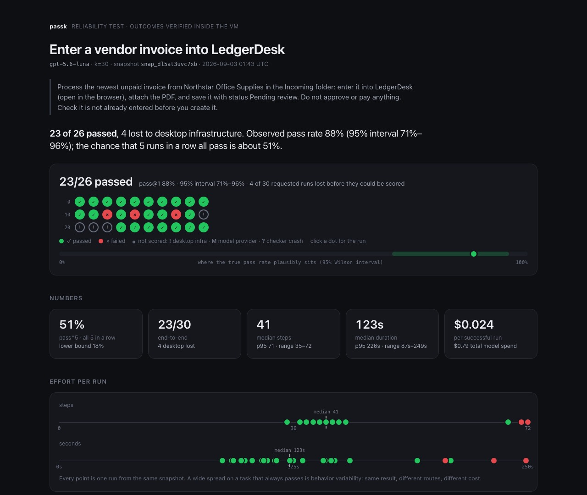

# Writing and running tasks

The operator's manual: setup, the task format, what `run` does, the shipped tasks, experiments, benching your own agent, and what is in and out of scope. Companion to the [README](../README.md) and [Method](METHOD.md).

## Setup

You need Node 20 or newer, a Solari account, and one model key.

```bash
git clone https://github.com/tohirr/solari-cookbook.git
cd solari-cookbook/passk
npm install
cp .env.example .env
```

Open `.env` and fill in:

| Variable | Where it comes from |
|---|---|
| `SOLARI_API_KEY` | [console.getsolari.com](https://console.getsolari.com) → API keys. The free tier allows 1 concurrent desktop; Starter allows 2 and includes $20 of credit. |
| `OPENAI_API_KEY` **or** `ANTHROPIC_API_KEY` | Your model provider. With both set, Claude is used unless `PASSK_PROVIDER=openai`. |
| `PASSK_MODEL` | Optional. `gpt-5.6-luna` is the budget tier every result here was produced on; leave unset for the provider's default. |
| `PASSK_SAFETY=allow` | Set this for benches: it lets the OpenAI loop acknowledge its own safety checks inside the disposable VM. Never set it anywhere real. |
| `PASSK_CONCURRENCY` | Optional. Defaults to 2. Match your Solari plan. |

Then confirm everything talks to everything:

```bash
npm run passk doctor
```

It checks the keys, reaches Solari, boots and kills one desktop, sends the
model a one-token request, and prints what a run would use. Fix anything it
marks ✗ before going further. The commands in these docs are written as
`passk …`; run them as `npm run passk -- …` or set `alias passk="npx tsx src/cli.ts"`
inside the `passk/` folder.

Results land in `runs/<task>-<timestamp>/` (ignored by git); the curated,
committed copies live in [`evidence/`](../evidence/).

The Claude agent loop is written but was not exercised during development
for want of a working key; every published result came from the OpenAI loop.

## Task status

Every task carries a `golden` block, the recipe for a correct outcome with
no agent involved, so `passk validate` can prove its checks fail before and
pass after. Status is one of **validated** (live runs published in
`evidence/`), **ready** (validated verifier, no published runs), or
**illustrative** (a sketch). An unrun task is never presented as evidence.

## Writing a task

```yaml
id: notes
name: Save a note in Mousepad
template: default          # default | office | code | your custom template
setup:                      # runs once, before the snapshot
  - open: mousepad
  - wait: 4
prompt: >                   # exactly what a user would type
  Type "hello" and save it as notes.txt in Documents.
golden:                     # the correct outcome with no agent; run proves the checks against it
  - write: /root/Documents/notes.txt
    content: hello
checks:                     # evaluated INSIDE the desktop after the agent stops
  - type: file_contains
    path: /root/Documents/notes.txt
    text: hello
```

Setup steps: `exec` (argv, no shell), `open` (launch a GUI app by name),
`write` (text to a guest path), `upload` (local file to a guest path), `click`
(x, y), `press` (a key or "+"-joined chord), `type` (literal text), `wait`
(seconds). Everything runs once, before the snapshot, so forks pay none of it.

Check types: `file_exists`, `file_contains`, `file_equals`, `exec` (exit code +
stdout), `screenshot_judge` (the model grades the final screen against a rubric).
Prefer several checks that each grade one fact over one script that grades
everything: a run still passes only if all of them pass, but the report then
carries a Checks table, pass count per check across the bench, worst first,
so a pass rate turns into a diagnosis. `tasks/ticket-routing.yaml` is the
example, with nineteen.
Any check may carry a `name` ("Invoice was created"); reports show it in
place of the raw path or command, which stays available for audit. Naming a
check changes neither grading nor the task hash.

<p align="center"><a href="../evidence/invoice-entry/report.html"></a></p>

## What `run` does

```
passk run tasks/notes.yaml --k 10

  prepare    no snapshot for this task yet? boot the template, run setup, snapshot, kill
  validate   fork once: the checks must fail untouched, agree with themselves twice,
             and pass after the golden steps. Unsound → exit 2, no bench.
  bench      fork ×k from the snapshot, agent loop on each, checks inside the VM, kill
  report     pass@1 with its interval, pass^k, divergence and cause per failure, report.html
```

Every step of that is also a command on its own (`prepare`, `validate`,
`report`, `classify`), for when you want one piece: `--prepare` forces a fresh
snapshot, `--no-validate` skips the verifier check while you iterate on a task,
`--resume` finishes an interrupted bench or extends a finished one with a
larger `--k`. The validation result is recorded on the bench and shown in its
report, so a number always says whether its verifier was proven.

The verifier check is the step that would have caught both verifier bugs
found during this work, and it is why an unsound task cannot produce a
number. It costs one desktop boot and no model calls unless a check is a
screenshot judge.

`passk sweep` kills anything tagged passk that an interrupted bench left
running. Task files carry a `yaml-language-server` schema hint; with the YAML
extension in VS Code you get completion and validation from
`schema/task.schema.json`.

## Tasks that ship

Every task is **validated**: its verifier proved sound and its live runs
published in [`evidence/`](../evidence/).

| Task | Template | Status | What it exercises |
|---|---|---|---|
| `notes` / `notes-nodir` | default | validated, 5 + 5 runs | Save-dialog handling; an environment pair (folder present vs missing) |
| `rename-invoices` / `-clarified` | default | validated, 5 + 5 runs | File manager; a prompt pair (ambiguous vs spelled out) |
| `q3-total` | office | validated, 10 runs | LibreOffice Calc, formulas, the CSV "keep format" dialog |
| `ticket-queue` / `-verify` / `-reload` | default | validated, 50 + 50 + 50 runs | An internal web tool served from inside the VM: no login, no proxy, state in a JSON file the checker reads. One of the customer's tickets is closed and must not be touched. Three prompt conditions on one snapshot. |
| `ticket-routing` | default | ready (verifier validated, no published runs yet) | The ticket queue, harder: twelve tickets, a Team page with the routing table, an SLA rule on ticket age, and traps: two customers named Acme, a row already correct, three closed rows. Nineteen checks grade one fact each, so the report's Checks table says which rule fails. |
| `invoice-entry` | office | validated, 30 runs | Accounts payable: read a PDF from Incoming, enter it into LedgerDesk (a mock AP tool served from inside the VM), attach the file, save as Pending review. A duplicate trap, a wrong-vendor decoy, and Approve/Pay buttons that must stay untouched. Verified against the ledger, including the attachment's sha256. |
| `fake` | none | harness test | Runs on the scripted provider; exercises the pipeline with no VM or model |

LedgerDesk and the ticket queue are mocks on purpose. A mock lets the bench
own the state, plant a trap, and verify exactly. What they keep from the real
thing is the shape: existing records to search, a duplicate to avoid, required
fields, dropdowns, a file upload, a business rule ("pending review"), and a
consequential action that must not happen.

The ticket queue is the shape of task Pinetree describes: a proprietary
dashboard with no API. Because the app lives in the snapshot, fifty runs cost
about a dollar on a budget model.

The shipped tasks are examples of the format, not a suite, and there is no
leaderboard of models. passk asks whether *your* agent is dependable on
*your* workflow; the argument is in [Method](METHOD.md#not-a-model-benchmark).

## Change one thing, measure again

The bench is the instrument; the experiment is the point. Fork the same
snapshot under two conditions, then compare:

```bash
passk run tasks/rename-invoices.yaml --k 5                                   # ambiguous prompt
passk run tasks/rename-invoices-clarified.yaml --k 5 --snapshot snap_…        # clarified prompt, same snapshot
passk compare runs/rename-invoices-*/ runs/rename-invoices-clarified-*/
```

`compare` says what was held fixed (snapshot, checks, model), what changed
(prompt, environment), the observed delta in passes, steps, time and cost per
success, and Fisher's exact p-value for the pass/fail split. It refuses to
attribute a difference when more than one thing changed. Note how little
small samples can prove: 4/10 against 9/10 looks decisive and is p = 0.057.

Before spending k runs on a new prompt, `passk probe` forks one throwaway
desktop, lets the agent look around, and has it list every question it would
ask a human. Tighten the prompt, re-probe, then bench. After a bench, `passk
recommend` reads the failures and suggests the one change to test next.

## Studio

The results board, on localhost, with your keys and a working Run button:

```bash
npm run studio          # http://127.0.0.1:8787, opens the browser
```

Paste your Solari key and a model key into the form; they are written to
`passk/.env` on this machine and go only to Solari and the model provider,
by the runs you start. Pick a shape, a model, k, a budget, and Start. Each
run is `passk run` in a child process with exactly the command the board
shows, so the button and the docs never disagree. Runs execute one at a
time; a second Start queues behind the first, so two benches never compete
for your Solari concurrency. The row appears as "local" when it finishes,
with its report. The board is served only on 127.0.0.1; nothing about a run
leaves your machine unless you export the bench into `evidence/` and send it
as a pull request, which is how the published board gains a row.

Try it with no keys: choose the model `scripted` and the row runs the
harness on in-memory desktops in a few seconds.

## Evidence

[`evidence/`](../evidence/) holds every bench cited in the README: `bench.json`
with every action, check, provenance record and task hash; the report page;
the final screenshot of every run; and every screenshot of every failed run
and of the shortest passing run. Comparison folders hold the paired results.
`passk export runs/<dir> evidence/<name>` copies a bench with only the
screenshots that carry proof; `sh scripts/curate-evidence.sh` rebuilds the
whole directory from `runs/`. `npm run assets` redraws the two still images
in `docs/` (failure evidence, how it works) from the same bench files.
`docs/demo.tape` records the no-key demo as a GIF with
[vhs](https://github.com/charmbracelet/vhs): `vhs docs/demo.tape`.

## Benching your own agent

The bundled loops are one Claude loop and one OpenAI loop, chosen by
`PASSK_PROVIDER`. A team with its own agent writes a third file in
`src/agent/` implementing the same interface (`AgentRunOptions →
AgentRunOutput` in `src/agent/index.ts`): it receives a live desktop handle,
the prompt, a step budget and an output directory, and returns the trace of
actions it took, its token usage, and how it stopped. Two rules make the
bench honest and are not negotiable: the agent never sees the task's checks,
and the agent's own claim of success is recorded but never graded. The
scripted agent in `src/agent/scripted.ts` is the smallest example.

## What passk can and cannot do today

**Supported.** Anything whose meaningful state lives inside the desktop, because
that is what a Solari snapshot isolates and a fork resets: LibreOffice and
other desktop applications, PDFs and files, local web tools served from the
VM, multi-application workflows across the three templates, custom templates,
benches of 50+ runs, and controlled comparisons of prompts on one snapshot.
Every result in [`evidence/`](../evidence/) is one of these.

**Experimental.** Written but not exercised: the Claude agent loop (no working
key during development). Architecturally supported but not demonstrated:
comparing two models on one snapshot. Likely to work with care: longer
workflows of 60 to 100 steps (raise `max_steps`, expect context growth and
higher cost per run), and local instances of heavier software such as an
Odoo container (longer boot, more memory).

**Unsupported.** Anything where the state the agent changes lives outside the
desktop. A snapshot resets the VM; it does not reset Gmail, Shopify, GitHub,
Salesforce, or a shared test database. Five forks told to "create an invoice
for Acme" against a live SaaS account will create five invoices, and the
checker cannot see any of them. Also out of scope: real payments, messages,
bookings or publishing; regulated or customer data; production enterprise
systems; multi-hour unattended tasks; adversarial task definitions; and
anything where a wrong action is irreversible.

**External state, if you need it.** The extension point is documented, not
built. A task that touches an external system would declare it and supply
lifecycle hooks:

```yaml
isolation: external          # default is "snapshot"
before_each:                 # reset or seed external state; runs on the host, not in the VM
  - exec: ./scripts/reset-test-tenant.sh
after_each:
  - exec: ./scripts/delete-test-records.sh --run ${RUN_ID}
checks:
  - type: http_json          # a verifier that queries the system from outside the agent's desktop
    url: ${LEDGER_TEST_API}/invoices/NOS-1047
    expect: { status: pending_review, total: 1333.0 }
```

The principle that must hold for any of it: verification runs from passk's
host process with credentials the agent never sees, and each run acts on
records it can identify as its own. Until those hooks exist, passk should not
be pointed at a system that other people can see.
